# robotac-g1-boxing

**Unitree G1 人形机器人的拳击动作迁移与击打力度仿真验证。**

基于 [unitree_rl_mjlab](https://github.com/unitreerobotics/unitree_rl_mjlab)（MuJoCo + mujoco-warp + RSL-RL PPO），
用运动模仿（motion tracking）把人类拳击动作迁移到 29 自由度 G1，并实现一套**击打力度仿真验证系统**，
用于量化出拳的接触冲击力。

> 本项目是对 ROBOTAC「拳击力量挑战」技术手册第 3.5 节「击打力度仿真验证」的完整实现与扩展。

> **赛事成绩**：第二十五届全国大学生机器人大赛 ROBOTAC 挑战赛「拳击力量挑战专项」**全国一等奖**
> （2026 年 7 月，授予单位：全国大学生机器人大赛组委会）

---

## 亮点

- **击打力度仿真验证**：在训练好的 tracking 策略回放时注入带力传感器的拳靶，实时读取并统计击打力度
- **三种靶子跟踪模式**：`motion`（跟参考轨迹）/ `actual`（跟实际拳头）/ `fixed`（固定标定位）
- **揭示测量陷阱**：`motion` 模式测得的力度严重虚高（靶子与参考拳位重叠导致的接触穿透伪影），
  只有 `fixed` 模式的读数是真实撞击力
- **靶位标定**：三维网格扫描自动搜索最优靶位，量化力度对靶位偏差的敏感性
- **完整部署链路**：PyTorch → ONNX + 观测归一化参数

---

## 实测数据

| 指标 | 数值 |
|------|------|
| 机器人 | Unitree G1，29 DOF |
| 训练动作 | Quick_Jab（466 帧 → 裁剪为 257 帧，60 fps） |
| 并行环境 | 1024（RTX 5060 Laptop 8GB） |
| 训练步数 | 95k → 330k，14+ 个 checkpoint |
| **最优固定靶力度峰值** | **303 N** @ 靶位 `(-0.220, -0.260, 0.880)` |
| 力度-靶位敏感性 | 靶位偏移 ≈1 cm，峰值从 ~300 N 掉到 ~110 N |
| 观测 / 动作维度 | 154 / 29，控制频率 50 Hz（物理 200 Hz） |

> 力度为**仿真内部量**，随 domain randomization 波动较大（同一靶位多次运行数十 N 级差异），
> 评估时需多轮统计。

---

## 系统架构

```mermaid
flowchart TD
    A["拳击动作数据 .npz<br/>body_pos_w / body_quat_w / joint_pos..."] --> B["mjlab Tracking 任务"]
    B --> B1["MotionCommand: 逐时间步给参考轨迹"]
    B --> B2["奖励: 多项 exp(-err/std²) + 自定义拳速激励"]
    B --> B3["动作: 29 维关节位置目标 → PD 力矩"]
    B1 & B2 & B3 --> C["PPO (RSL-RL, 1024 envs)"]
    C --> D["Actor MLP(512-256-128) → 29 维动作"]
    D --> E[".pt checkpoint"]
    E --> F["击打力度验证系统<br/>拳靶 + ContactSensor"]
    F --> F1["motion 模式: 靶跟参考轨迹 (虚高)"]
    F --> F2["actual 模式: 靶跟实际拳头"]
    F --> F3["fixed 模式: 靶固定标定位 (真实撞击力)"]
    F --> G["三维网格扫描标定最优靶位"]
    E --> H["导出 policy.onnx + obs_normalizer.json"]
```



---

## 目录结构

```
robotac-g1-boxing/
├── scripts/          # 本项目脚本
│   ├── play_punch.py          # 回放 + 击打力度验证（核心）
│   ├── batch_force_test.py    # 批量靶位/动作力度测试
│   ├── trim_npz.py            # 动作 NPZ 裁剪（拳峰检测）
│   ├── export_deploy.py       # 导出 ONNX + 归一化参数
│   ├── play_headless.py       # 无头渲染视频
│   ├── extract_punches.py     # 从完整动作提取出拳段
│   └── analyze_fist_traj.py   # 拳速轨迹分析
├── patches/          # 对 unitree_rl_mjlab 的修改（见下）
├── docs/             # 技术文档
├── data/             # 动作数据（Quick_Jab / B_AttackKarate）
└── models/           # 里程碑模型（.pt + ONNX + 归一化参数，见 models/README.md）
```

---

## 对 unitree_rl_mjlab 的修改

本项目不改动框架主体，只做**局部扩展**。`patches/` 下是相对上游改动的文件：

| patch 文件 | 上游位置 | 改动 |
|-----------|---------|------|
| `tracking_env_cfg.py` | `src/tasks/tracking/` | 奖励函数：手臂 4x 加权 + 自定义拳速激励 + 自碰撞惩罚 |
| `mdp_rewards.py` | `src/tasks/tracking/mdp/` | 新增 `fist_velocity_reward` / `self_collision_cost` |
| `config_g1_env_cfgs.py` | `src/tasks/tracking/config/g1/` | play 模式注入拳靶实体 + ContactSensor |
| `config_g1___init__.py` | 同上 | 注册 `Unitree-G1-Tracking-No-State-Estimation` 任务 |
| `config_g1_rl_cfg.py` | 同上 | PPO 超参（默认） |
| `scripts_play.py` | `scripts/` | ① mujoco 3.10 / mujoco-warp 兼容 monkey-patch ② 力度追踪 |

---

## 技术难点

**1. 用力反推 ≠ 真实力度：识别"穿透惩罚"伪影**

`motion` 模式把靶子放在参考轨迹的拳位上。策略跟踪得好时，实际拳头与靶子几乎重叠，
MuJoCo 接触求解器判定为"穿透"，反推出几百牛的接触力——读起来很漂亮，但它是**数值伪影**，不是击打力。
只有把靶子独立固定（`fixed` 模式），拳头必须真实撞上去，读数才是物理量。这一区分决定了整个评估基准是否成立。

**2. 奖励函数里的多目标平衡**

跟踪奖励总和约 15。把拳速激励权重从 1.5 提到 3.0 后，策略为最大化拳速牺牲跟踪精度，动作崩溃、连靶子都打不中；
同时 `action_acc_l2`（动作加速度惩罚）本意压手臂抖动，却把出拳的正常加速一起压住，等于给爆发力加刹车。
最终方案：手臂 4x 加权 + 拳速权重 2.0 + 去掉加速度惩罚。

**3. mujoco / mujoco-warp 版本错位**

mujoco-warp 需要 `mujoco.mjtEnableBit.mjENBL_MULTICCD`，而 mujoco 3.10 尚未提供该枚举。
在不改动第三方包的前提下，用运行时 monkey-patch 补齐该位。

---

## 快速开始

> 前置：先安装 [unitree_rl_mjlab](https://github.com/unitreerobotics/unitree_rl_mjlab)（会带入 mjlab / MuJoCo / mujoco-warp / RSL-RL）。
> 建议 Linux 或 WSL2；有 NVIDIA GPU。

```bash
# 1. 安装依赖
pip install -r requirements.txt

# 2. 把 patches/ 下的文件覆盖到 unitree_rl_mjlab 对应位置（见上表）

# 3. 击打力度验证（固定靶模式）
python scripts/play_punch.py Unitree-G1-Tracking-No-State-Estimation \
    --agent trained \
    --checkpoint-file <你的 checkpoint.pt> \
    --motion-file data/Quick_Jab_train.npz \
    --punch-track-mode fixed \
    --fixed-target-pos -0.220 -0.260 0.880 \
    --result-file force.json

# 4. 从 checkpoint 导出部署产物（ONNX + 归一化参数）
python scripts/export_deploy.py <checkpoint.pt> <输出目录>
```

**模式说明**：`--punch-track-mode` 取 `fixed`（推荐，真实撞击力）/ `motion` / `actual`。

---

## 数据与隐私说明

- 动作数据（`data/*.npz`）来自 G1 Moves 公开动作数据集，仅用于示例复现。
- 训练权重放在 `models/`：收录 3 个里程碑模型（249999 / 299999 / 330000）的 `.pt` + ONNX + 归一化参数。
  全部中间 checkpoint（100+ 个）未入库，如需可用 `scripts/export_deploy.py` 自行导出。
- 本仓库不包含任何个人信息、凭据或本机路径。

---

## 参考

- **RoboStriker: Hierarchical Decision-Making for Autonomous Humanoid Boxing**（SJTU / 上海人工智能实验室 / PKU 等）— 人形机器人拳击的三阶段分层框架，本项目的运动跟踪阶段与其第一阶段同源
- [unitree_rl_mjlab](https://github.com/unitreerobotics/unitree_rl_mjlab) — 训练框架
- BeyondMimic / whole_body_tracking — tracking 任务的方法来源
